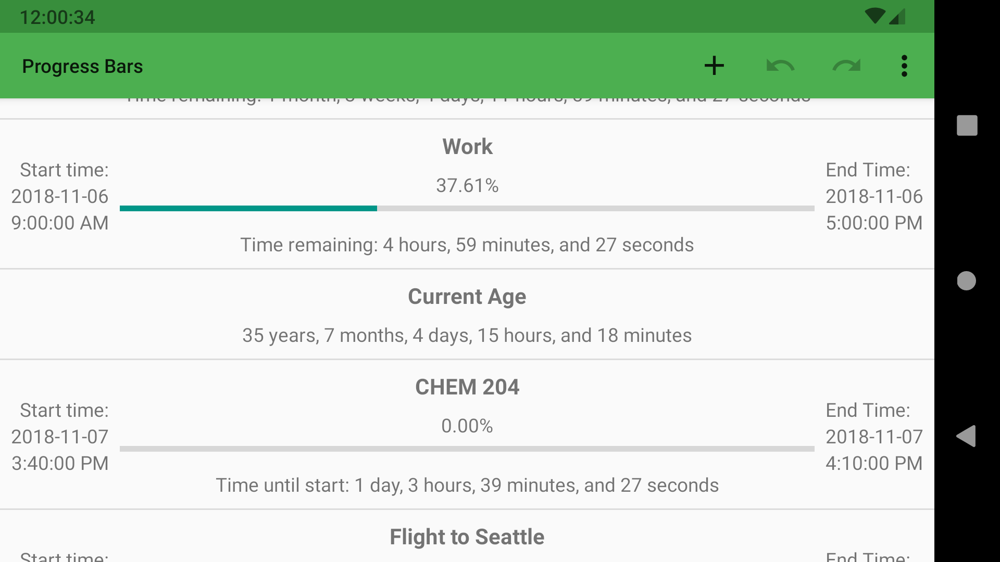

# ProgressBars

ProgressBars is a simple timer / countdown app for Android.

### Basic Features
* Countdown/up to/from a specified time
* Percentage complete for a time interval
* Notifications on timer completion
* Swipe to delete timers
* Drag to reorder timers
* Show time remaining / elapsed in any combination of:
    * Years
    * Months
    * Weeks
    * Days
    * Hours
    * Minutes
    * Seconds
